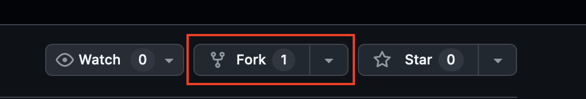

# Soft Skills

กิจกรรมส่งเสริมทักษะการเรียนรู้

## วิธีการดาวน์โหลดและใช้งาน

### ขั้นตอนที่ 1: Fork Repository
1. เข้าไปที่หน้า GitHub ของ repository นี้
2. หาปุ่ม **Fork** ที่อยู่มุมขวาบนของหน้าเว็บ (ดังรูป)
3. กดปุ่ม Fork เพื่อสร้างสำเนาของ repository นี้ไว้ใน GitHub account ของคุณ



### ขั้นตอนที่ 2: ดาวน์โหลดมาใช้งานในเครื่อง
1. ติดตั้ง Git (หากยังไม่มี): [https://git-scm.com](https://git-scm.com)
2. เปิด Command Prompt หรือ Terminal
3. ดาวน์โหลด repository ที่คุณ fork มาแล้ว:
   ```bash
   git clone https://github.com/<your-username>/soft_skills.git
   ```
   > **หมายเหตุ**: เปลี่ยน `<your-username>` เป็นชื่อ GitHub account ของคุณ
4. เข้าไปในโฟลเดอร์:
   ```bash
   cd soft_skills
   ```

## โครงการนี้ประกอบด้วยไฟล์ดังนี้:

- `/docs` - โฟลเดอร์สำหรับเก็บเอกสารต่างๆ
- `/problems` - โฟลเดอร์สำหรับเก็บไฟล์งานที่ได้รับมอบหมาย
- `README.md` - คำแนะนำและคู่มือการใช้งาน Git
- `SUMMARY.md` - สรุปผลการเรียนรู้และการพัฒนาทักษะ

## เริ่มต้นใช้งาน

### 🎯 เป้าหมายของกิจกรรม
กิจกรรมนี้จะช่วยให้คุณได้เรียนรู้ **ทักษะการแก้ปัญหา** และ **การทำงานร่วมกันแบบมีระบบ** ผ่านการใช้เครื่องมือ Git และการเขียนโปรแกรม

### �️ ภาพรวมของกิจกรรม
- **เวลารวม**: 40 นาที
- **วิธีการ**: ทำงานเป็นกลุ่ม แต่ละกลุ่มจะได้พื้นที่การทำงานแยกจากกัน
- **สิ่งที่จะได้เรียนรู้**: การแก้ไขโค้ด การทำงานร่วมกัน และการจัดการเวอร์ชันของงาน

### �📋 ขั้นตอนการทำกิจกรรม

#### Phase 1: เตรียมพื้นที่การทำงาน (5 นาที)
> **เป้าหมาย**: สร้างพื้นที่การทำงานส่วนตัวสำหรับกลุ่ม โดยไม่กระทบกับกลุ่มอื่น

**สิ่งที่ต้องทำ**:
1. **สร้างพื้นที่การทำงานใหม่** - แต่ละกลุ่มจะได้พื้นที่แยกจากกันชื่อตามชื่อกลุ่ม
2. **สำรวจไฟล์งาน** - ดูว่ามีไฟล์อะไรบ้างในโฟลเดอร์ `problems/` และเข้าใจโครงสร้าง

**เทคนิคที่จะได้เรียนรู้**: การจัดการ workspace และการสำรวจโครงสร้างโปรเจค

#### Phase 2: ทดลองและวิเคราะห์ปัญหา (15 นาที)
> **เป้าหมาย**: เข้าใจปัญหาและเริ่มแก้ไขด้วยการลองผิดลองถูก

**สิ่งที่ต้องทำ**:
1. **ทดลองรันโปรแกรม** - เปิดไฟล์ `problems/section1.py` และ `problems/section2.py` แล้วลองรัน
2. **สังเกตผลลัพธ์** - ดูว่าเกิดอะไรขึ้น มี error หรือผลลัพธ์ไม่ตรงตามที่คาดหวัง
3. **วิเคราะห์และแก้ไข** - ใช้ความคิดวิเคราะห์เพื่อหาสาเหตุและแก้ไขปัญหา

**เทคนิคที่จะได้เรียนรู้**: Debugging, Problem-solving methodology, และการอ่าน error messages

#### Phase 3: เรียนรู้หลักการและประยุกต์ใช้ (10 นาที)
> **เป้าหมาย**: เข้าใจหลักการที่ใช้แก้ปัญหา และนำไปใช้กับปัญหาใหม่

**สิ่งที่ต้องทำ**:
1. **รับฟังการสรุป** - เรียนรู้เทคนิคและหลักการที่ใช้ในการแก้ปัญหาใน Phase 2
2. **ลองประยุกต์ใช้** - นำความรู้ใหม่ไปแก้ไขปัญหาใน `problems/section3.py`

**เทคนิคที่จะได้เรียนรู้**: Pattern recognition และการนำความรู้ไปประยุกต์ใช้

#### Phase 4: สรุปผลและบันทึกความรู้ (10 นาที)
> **เป้าหมาย**: สะท้อนผลการเรียนรู้และบันทึกงานอย่างเป็นระบบ

**สิ่งที่ต้องทำ**:
1. **เขียนสะท้อนความคิด** - บันทึกสิ่งที่เรียนรู้ในไฟล์ `SUMMARY.md`
2. **บันทึกผลงาน** - ใช้ระบบจัดการเวอร์ชันเพื่อบันทึกและส่งงาน

**เทคนิคที่จะได้เรียนรู้**: Self-reflection, Documentation และ Version control workflow

## 📝 คู่มือการใช้งาน Git

### การจัดการ Branch

#### สร้าง Branch ใหม่
```bash
# สร้าง branch ใหม่และสลับไปใช้งาน
git checkout -b <branch-name>
```

#### สลับ Branch
```bash
# สลับไปยัง branch ที่มีอยู่แล้ว
git checkout <branch-name>

# กลับไปยัง branch หลัก
git checkout master
```

### 💾 การเตรียมไฟล์และบันทึกการเปลี่ยนแปลง (Staging & Commit)

#### เลือกไฟล์ที่จะบันทึก (Staging Area)
> **คำอธิบาย**: Staging Area คือพื้นที่กลางที่เก็บไฟล์ที่เราต้องการบันทึกในครั้งนี้ เหมือนการใส่ของลงตะกร้าก่อนไปจ่ายเงิน
```bash
# เลือกไฟล์เดี่ยวที่ต้องการบันทึก
git add <filename>

# เลือกไฟล์ทั้งหมดที่มีการเปลี่ยนแปลง
git add .
```

#### บันทึกการเปลี่ยนแปลง (Commit)
```bash
# บันทึกการเปลี่ยนแปลงพร้อมข้อความอธิบาย
git commit -m "<commit-message>"
```

### 📤 การส่งการเปลี่ยนแปลงไปยัง Remote Repository

```bash
# ส่งการเปลี่ยนแปลงไปยัง remote repository
git push origin -u <branch-name>
```
